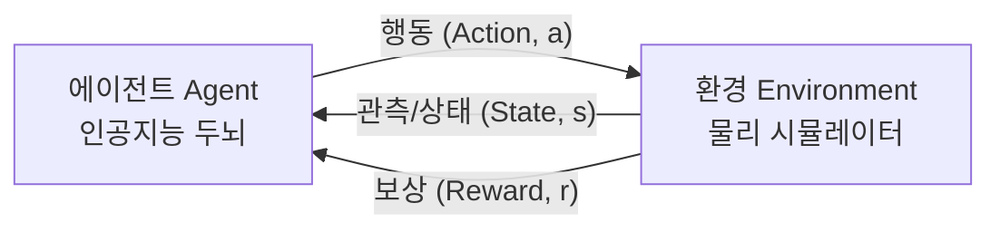
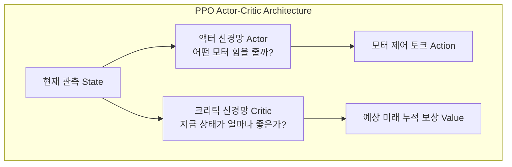

# 🦆 MicroDuck RL Lab: 입문자를 위한 심층 강화학습 & 3D 물리 로봇 제어 완벽 가이드

> **"수학 공식을 몰라도 괜찮습니다. 넘어져 보고 다시 일어서는 가상 로봇과 함께 강화학습의 핵심 원리를 직관적으로 체득해 보세요!"**

---

## 📑 목차

1. [강화학습(RL)이란 무엇인가? - 핵심 개념 5가지](#1-강화학습rl이란-무엇인가---핵심-개념-5가지)
2. [이산 행동(Discrete) vs 연속 제어(Continuous Control)](#2-이산-행동discrete-vs-연속-제어continuous-control)
3. [왜 PPO(Proximal Policy Optimization)인가?](#3-왜-ppoproximal-policy-optimization인가)
4. [가상 물리 엔진 MuJoCo와 MJCF 모델링 원리](#4-가상-물리-엔진-mujoco와-mjcf-모델링-원리)
5. [보상 함수(Reward) 엔지니어링의 마법과 '보상 해킹'](#5-보상-함수reward-엔지니어링의-마법과-보상-해킹)
6. [단계별 실습 커리큘럼 (CartPole부터 MicroDuck까지)](#6-단계별-실습-커리큘럼-cartpole부터-microduck까지)
7. [TensorBoard 지표를 읽고 학습 상태 진단하기](#7-tensorboard-지표를-읽고-학습-상태-진단하기)
8. [직접 도전해보는 3가지 실습 퀘스트](#8-직접-도전해보는-3가지-실습-퀘스트)
9. [브라우저에서 직접 강화학습 해보기 (인터랙티브 훈련)](#9-브라우저에서-직접-강화학습-해보기-인터랙티브-훈련)

---

## 1. 강화학습(RL)이란 무엇인가? - 핵심 개념 5가지

강화학습(Reinforcement Learning)은 아이가 걸음마를 배우거나, 강아지가 훈련을 받는 과정과 정확히 같습니다.
선생님이 정답(라벨)을 알려주는 **지도학습(Supervised Learning)**과 달리, 에이전트가 환경과 직접 상호작용하며 **시행착오(Trial and Error)**를 통해 최적의 행동 방식을 스스로 깨우칩니다.



### 필수 5대 구성 요소

| 용어 | 쉬운 비유 | MicroDuck 오리 로봇에서의 실제 예시 |
| :--- | :--- | :--- |
| **에이전트 (Agent)** | 배우는 주체 (인공지능 뇌) | PPO 신경망 모델 (`models/microduck_ppo.zip`) |
| **환경 (Environment)** | 세상 (물리 법칙이 적용되는 시뮬레이터) | MuJoCo 물리 엔진 + 중력, 바닥 마찰력 (`MicroDuck-v1`) |
| **상태/관측 (Observation)** | 에이전트가 눈과 감각으로 느끼는 정보 | 몸통 높이, 기울기, 6개 관절 각도, 속도 (총 23차원 숫자) |
| **행동 (Action)** | 에이전트가 내리는 물리적 명령 | 6개 관절 모터에 전달하는 힘(토크) `[-1.0, 1.0]` |
| **보상 (Reward)** | 칭찬(+)과 벌(-) | 앞으로 걸어가면 `+보상`, 넘어지면 `종료`, 모터를 너무 세게 쓰면 `-벌점` |

---

## 2. 이산 행동(Discrete) vs 연속 제어(Continuous Control)

강화학습 환경은 행동의 형태에 따라 크게 둘로 나뉩니다.

### 1) 이산 행동 공간 (Discrete Action Space)
* **특징**: 선택지가 버튼처럼 딱딱 끊어져 있음 (예: 게임 패드의 상/하/좌/우 버튼).
* **대표 예시: `CartPole-v1`**
  * 행동: `0(왼쪽으로 밀기)` 또는 `1(오른쪽으로 밀기)`.
  * 아주 단순한 신경망(DQN 등)으로도 쉽게 학습 가능.

### 2) 연속 제어 공간 (Continuous Control Space)
* **특징**: 모터의 힘처럼 실숫값(소수점)을 미세하게 조절해야 함.
* **대표 예시: `Hopper-v5`, `MicroDuck-v1`, `Humanoid-v5`**
  * 행동: `[+0.42, -0.85, +0.12, ...]` (각 관절에 걸어줄 정확한 토크값).
  * 물리 로봇은 모터를 "켜고 끄는" 것이 아니라 "부드럽게 42% 출력으로 조절"해야 넘어지지 않습니다.
  * 따라서 훨씬 발전된 **연속 정책 알고리즘(PPO, SAC)**이 필수적입니다.

---

## 3. 왜 PPO(Proximal Policy Optimization)인가?

우리 프로젝트에서 사용하는 핵심 알고리즘은 OpenAI가 개발한 **PPO(Proximal Policy Optimization)**입니다.
현재 자율주행, 보스턴 다이내믹스형 4족 보행, ChatGPT의 RLHF(인간 피드백 강화학습) 등에 가장 널리 쓰이는 표준 알고리즘입니다.



### PPO의 핵심 마법: "한 번에 너무 무리해서 정책을 바꾸지 마라! (Clipped Objective)"
* 과거의 강화학습 알고리즘들은 "어? 이번에 앞으로 한 걸음 내디뎠더니 보상이 좋네?" 하고 신경망 가중치를 갑자기 너무 크게 업데이트했다가, 다음 스텝에서 아예 걷지도 못하고 고장 나는 현상(성능 급락)이 잦았습니다.
* PPO는 이전 정책과 새로운 정책의 변화율을 **$1 - \epsilon \sim 1 + \epsilon$ (보통 0.8 ~ 1.2, 즉 20% 이내)**로 **클리핑(Clipping)**하여, 항상 안정적이고 꾸준하게 우상향 수렴하도록 보장합니다.

---

## 4. 가상 물리 엔진 MuJoCo와 MJCF 모델링 원리

물리 로봇을 실제로 만들어서 강화학습을 시키면, 수만 번 넘어지면서 수백만 원짜리 모터와 부품이 부서집니다.
그래서 우리는 구글 딥마인드의 세계 최고 물리 시뮬레이터인 **MuJoCo(Multi-Joint dynamics with Contact)**를 사용합니다.

### 🦆 `microduck.xml` 파일 뜯어보기 (MJCF 모델링)

우리 오리 로봇은 XML 태그 몇 개로 완벽한 물리적 법칙을 부여받았습니다:

```xml
<mujoco model="microduck">
  <!-- 1. 중력과 적분기 설정: 1초에 200번 물리 연산 (timestep 0.005s) -->
  <option integrator="RK4" timestep="0.005" gravity="0 0 -9.81"/>

  <!-- 2. 몸체(Worldbody): 노란 오리 몸통과 머리, 부리 -->
  <body name="torso" pos="0 0 0.55">
    <freejoint name="root"/> <!-- 공중에 자유롭게 떠 있는 6자유도 루트 -->
    <geom type="ellipsoid" size="0.16 0.13 0.12" rgba="1.0 0.85 0.05 1"/> <!-- 몸통 -->

    <!-- 3. 왼쪽 다리 관절: 엉덩이(Hip), 무릎(Knee), 발목(Ankle) -->
    <body name="left_thigh" pos="0 0.08 -0.08">
      <joint name="left_hip" type="hinge" axis="0 1 0" range="-50 50"/>
      ...
      <!-- 넓은 물갈퀴 발: 지면 접지 마찰력을 높여 넘어짐 방지 -->
      <geom name="left_foot_geom" type="box" size="0.09 0.06 0.018"/>
    </body>
  </body>

  <!-- 4. 액추에이터(Actuator): 6개 관절 모터 정의 -->
  <actuator>
    <motor name="left_hip_motor" joint="left_hip" gear="80"/>
    <motor name="left_knee_motor" joint="left_knee" gear="80"/>
    <motor name="left_ankle_motor" joint="left_ankle" gear="50"/>
    ...
  </actuator>
</mujoco>
```

---

## 5. 보상 함수(Reward) 엔지니어링의 마법과 '보상 해킹'

강화학습에서 가장 중요한 것은 **"어떤 기준으로 칭찬할 것인가?"**를 수학식으로 만드는 것입니다.

### 🦆 MicroDuck의 보상 함수 공식 (`microduck_env.py`)

$$R_t = \underbrace{1.5 \times v_x}_{\text{전진 보상}} + \underbrace{1.0}_{\text{직립 생존 보상}} - \underbrace{0.005 \times \|\mathbf{a}\|^2}_{\text{모터 에너지 절약 벌점}} - \underbrace{0.5 \times |v_y|}_{\text{좌우 흔들림 억제}}$$

1. **전진 속도 보상 ($1.5 \times v_x$)**: 앞으로 빠르게 달릴수록 더 큰 칭찬을 줍니다.
2. **생존 보상 ($+1.0$)**: 넘어지지 않고 두 발로 서 있는 매 순간마다 1점씩 줍니다.
3. **제어 비용 페널티 ($-0.005 \|\mathbf{a}\|^2$)**: 모터 힘을 무식하게 100% 풀파워로 쓰면 감점합니다 (실제 모터 과열 방지 및 부드러운 걸음 유도).
4. **횡방향 이탈 페널티 ($-0.5 |v_y|$)**: 옆으로 게걸음치거나 비틀거리지 않고 곧게 앞으로 전진하도록 유도합니다.

### ⚠️ 주의: '보상 해킹(Reward Hacking)'이란?
* 만약 **생존 보상($+1.0$)**을 너무 크게 주고 전진 보상을 적게 주면 어떻게 될까요?  
  👉 로봇은 앞으로 걷다가 넘어질 바에는 **"제자리에 가만히 서 있는 게 이득이다!"**라고 판단하여 전혀 걷지 않는 얼음 로봇이 됩니다.
* 만약 **전진 보상**만 주고 생존 보상을 안 주면?  
  👉 로봇은 발로 걷지 않고 앞으로 **다이빙하듯 몸통을 던져서 1m 전진 후 꽈당** 쓰러지는 기괴한 행동을 학습합니다.
* 따라서 **'앞으로 가는 욕망'**과 **'넘어지지 않으려는 신중함'** 사이의 완벽한 밸런스를 잡는 것이 강화학습 엔지니어링의 핵심입니다!

---

## 6. 단계별 실습 커리큘럼 (CartPole부터 MicroDuck까지)

MicroDuck RL Lab은 난이도 순서대로 4단계 로드맵으로 구성되어 있습니다:

```text
[Step 1: 기초 밸런싱]  --->  [Step 2: 단각/2족 보행]  --->  [Step 3: 4족/치타/휴머노이드]  --->  [Step 4: 나만의 오리 창작]
   CartPole-v1                Hopper & Walker2d            Ant, Cheetah, Humanoid                MicroDuck-v1
(이산 행동, 500점)          (연속 토크, 도약과 보행)      (다관절 협응, 전신 균형)             (MJCF 모델링 & 보상 설계)
```

### 1단계: CartPole-v1 (기초 밸런싱)
* 손바닥 위에 빗자루를 세우는 균형 잡기.
* 학습 시간: 약 10초. 만점 500점 달성.

### 2단계: Hopper-v5 & Walker2d-v5 (도약과 2족 보행)
* Hopper(1다리 캥거루 로봇): 접지 충격을 흡수하고 용수철처럼 도약.
* Walker2d(인간 하체 2족 로봇): 두 다리의 180도 위상차 교차 보행.

### 3단계: Ant-v5, HalfCheetah-v5 & Humanoid-v5 (고난도 다관절)
* Ant: 4개 다리가 대각선으로 번갈아 움직이는 크롤링(Crawling) 보행으로 1,000스텝 완주.
* Cheetah: 넘어짐 없이 최고 속도로 질주하는 스프린트 제어.
* Humanoid: 17개 관절, 376차원의 방대한 상태 공간에서 두 발로 직립 균형 유지.

### 4단계: MicroDuck-v1 (나만의 커스텀 로봇 창작)
* XML 모델링부터 보상 함수 설계까지 직접 나만의 로봇을 만들고 PPO로 훈련!

---

## 7. TensorBoard 지표를 읽고 학습 상태 진단하기

브라우저(`http://127.0.0.1:6006`)에서 TensorBoard를 열었을 때 어떤 그래프를 봐야 할까요?

```text
1. rollout/ep_rew_mean (에피소드 평균 보상)  ⭐⭐⭐⭐⭐
   - 가장 중요한 지표! 학습이 진행됨에 따라 우상향 곡선을 그리면 성공적인 학습.
   - MicroDuck의 경우: 17점(Random) -> 47점(PPO)으로 가파르게 상승.

2. rollout/ep_len_mean (에피소드 평균 생존 스텝수)  ⭐⭐⭐⭐
   - 로봇이 넘어지지 않고 얼마나 오랫동안 버텼는지를 나타냄.

3. train/loss & train/value_loss (가치 함수 손실)  ⭐⭐⭐
   - 크리틱(Critic) 신경망이 상태의 가치를 얼마나 잘 예측하고 있는지를 평가.

4. train/entropy_loss (엔트로피 손실)  ⭐⭐⭐
   - 에이전트의 "호기심/탐색(Exploration) 수준".
   - 처음에는 다양하게 행동을 시도하다가(높은 엔트로피), 점차 최적 행동으로 좁혀짐(엔트로피 감소).
```

---

## 8. 직접 도전해보는 3가지 실습 퀘스트

이론을 배웠다면 직접 코드를 수정해보며 차이를 눈으로 확인해 보세요!

### 🎯 퀘스트 1: CartPole 학습률(Learning Rate) 튜닝 실험
* **실습 파일**: [`train_cartpole.py`](file:///c:/Users/vikin/OneDrive/바탕%20화면/Antigravity%20IDE/microduck_rl/train_cartpole.py)
* **미션**: `learning_rate=1e-3`을 `1e-2`(10배 빠르게) 또는 `1e-4`(10배 느리게)로 바꾸고 학습시켜 보세요.
* **관찰 포인트**: 학습률이 너무 크면 왜 점수가 요동치고 만점에 도달하지 못하는지 관찰합니다.

### 🎯 퀘스트 2: 초절전형 에너지 절약 오리 로봇 만들기
* **실습 파일**: [`microduck_env.py`](file:///c:/Users/vikin/OneDrive/바탕%20화면/Antigravity%20IDE/microduck_rl/microduck_env.py)
* **미션**: `ctrl_cost_weight`를 기본값 `0.005`에서 `0.05`로 10배 높여보세요.
* **관찰 포인트**: 모터 사용 벌점이 커지면 오리가 다리를 요란하게 휘두르지 않고 최소한의 힘으로 사뿐사뿐 걷는 모션으로 변화합니다!

### 🎯 퀘스트 3: 오리 로봇 20만 스텝 심화 마라톤 학습
* **실습 명령어**:
  ```powershell
  python train_mujoco.py --env MicroDuck-v1 --timesteps 200000
  ```
* **관찰 포인트**: 6만 스텝일 때보다 보폭이 얼마나 더 안정적이고 길게 유지되는지 3D 뷰어로 확인해 보세요.

---

## 9. 브라우저에서 직접 강화학습 해보기 (인터랙티브 훈련)

로컬 개발 환경이나 파이썬 패키지 설치가 어려운 환경에서도, **웹 브라우저 접속만으로 강화학습의 전 과정(훈련 ➔ 실시간 평가 ➔ 모델 다운로드)을 직접 실행**할 수 있습니다!

* **접속 주소**: [https://microduckrl.streamlit.app/](https://microduckrl.streamlit.app/)
* **탭 위치**: `⚡ Interactive Training (브라우저 실시간 학습)`

```
┌────────────────────────────────────────────────────────────────────────┐
│ ⚡ Interactive Browser Training Lab                                    │
├──────────────────────────────┬─────────────────────────────────────────┤
│ [⚙️ 하이퍼파라미터 조절]      │ [📡 실시간 훈련 모니터링]               │
│ - 학습 대상: CartPole / 오리 │ - 실시간 진행률 바 (Progress Bar)       │
│ - 스텝 수: 1,000 ~ 10,000     │ - 에피소드 보상 상승 그래프 (Line Chart)│
│ - 학습률(LR): 1e-4 ~ 1e-2    │ - 훈련 전후 점수 향상 비교 카드        │
│ [🚀 브라우저에서 즉시 학습]   │ - [💾 훈련된 모델 다운로드 (.zip)]      │
└──────────────────────────────┴─────────────────────────────────────────┘
```

### 💡 브라우저 실습 추천 코스
1. **CartPole-v1 3초 완성**:
   - `CartPole-v1` 선택 후 3,000스텝으로 학습 시작 버튼 클릭.
   - 단 2~3초 만에 막대의 생존 보상이 10점대에서 300~500점(만점)으로 치솟는 과정을 실시간 차트로 확인!
2. **MicroDuck-v1 오리 로봇 훈련**:
   - `MicroDuck-v1` 선택 후 2,048스텝으로 학습 시작.
   - 보행 보상이 상승하는 과정을 보고, 방금 브라우저에서 만들어진 오리 모델 가중치(`.zip`)를 내 컴퓨터로 다운로드!

---

### 💡 한눈에 보는 실행 도구 요약

* **온라인 웹 대시보드 (클라우드)**: [https://microduckrl.streamlit.app/](https://microduckrl.streamlit.app/)
* **로컬 웹 대시보드**: `python launch_dashboard.py` (브라우저: `http://127.0.0.1:8501`)
* **마스터 콘솔 런처**: `python launcher.py` (또는 `run.bat` 더블클릭)
* **실시간 3D 오리 뷰어**: `python visualize_agent.py --env MicroDuck-v1 --human --loop`
* **8패널 학습 곡선 이미지**: `start logs/learning_curves.png`
* **TensorBoard 지표**: `http://127.0.0.1:6006`

> **Happy Reinforcement Learning with MicroDuck! 🦆🤖**

